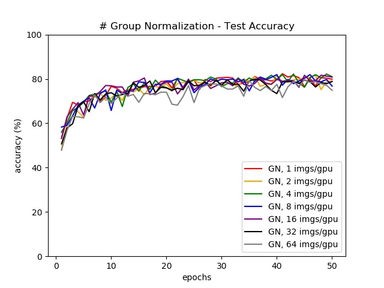

# Group Normalization

## # Dataset ([Flowers](#-Reference) 8 : 2)
```
flower_dataset/
└─ train
    └─ daisy
    └─ dandelion
    └─ roses
    └─ sunflowers
    └─ tulips
└─ test
    └─ daisy
    └─ dandelion
    └─ roses
    └─ sunflowers
    └─ tulips
```

## # Summary


## # Code
```python
def group_normalization(x, is_training, G = 32, ESP = 1e-5, scope = 'group_norm'):
    with tf.variable_scope(scope):
        # 1. [N, H, W, C] -> [N, C, H, W]
        x = tf.transpose(x, [0, 3, 1, 2])
        N, C, H, W = x.shape.as_list()

        # 2. reshape (group normalization)
        G = min(G, C)
        x = tf.reshape(x, [-1, G, C // G, H, W])
        
        # 3. get mean, variance
        mean, var = tf.nn.moments(x, [2, 3, 4], keep_dims=True)
        # 4. normalize
        x = (x - mean) / tf.sqrt(var + ESP)

        # 5. create gamma, bete
        gamma = tf.Variable(tf.constant(1.0, shape = [C]), dtype = tf.float32, name = 'gamma')
        beta = tf.Variable(tf.constant(0.0, shape = [C]), dtype = tf.float32, name = 'beta')

        gamma = tf.reshape(gamma, [1, C, 1, 1])
        beta = tf.reshape(beta, [1, C, 1, 1])

        # 6. gamma * x + beta
        x = tf.reshape(x, [-1, C, H, W]) * gamma + beta

        # 7. [N, C, H, W] -> [N, H, W, C]
        x = tf.transpose(x, [0, 2, 3, 1])
    return x
```

## # Run
```sh
python Train.py --batch_size=1 --norm_type=batch
python Train.py --batch_size=2 --norm_type=batch
python Train.py --batch_size=4 --norm_type=batch
python Train.py --batch_size=8 --norm_type=batch
python Train.py --batch_size=16 --norm_type=batch
python Train.py --batch_size=32 --norm_type=batch
python Train.py --batch_size=64 --norm_type=batch

python Train.py --batch_size=1 --norm_type=group
python Train.py --batch_size=2 --norm_type=group
python Train.py --batch_size=4 --norm_type=group
python Train.py --batch_size=8 --norm_type=group
python Train.py --batch_size=16 --norm_type=group
python Train.py --batch_size=32 --norm_type=group
python Train.py --batch_size=64 --norm_type=group

python Generate_Graph.py
```

## # Results (BN vs GN)




## # Reference
- Flowers (http://download.tensorflow.org/example_images/flower_photos.tgz)
- Group Normalization [[Paper]](https://arxiv.org/pdf/1803.08494.pdf)
- Batch Normalization: Accelerating Deep Network Training by Reducing Internal Covariate Shift [[Paper]](https://arxiv.org/pdf/1502.03167.pdf)